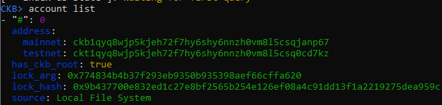
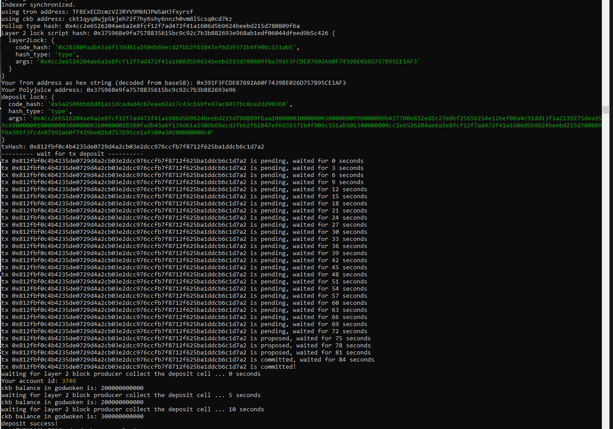
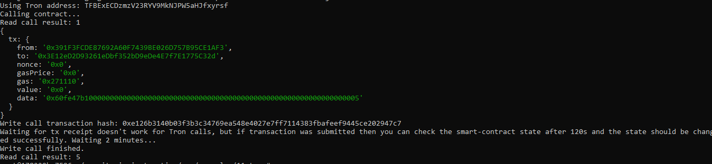

# Nervos Hackerthon - Gitcoin 11

1. A screenshot of the accounts you created (account list) in ckb-cli.

2. A link to the Layer 1 address you funded on the Testnet Explorer.
https://explorer.nervos.org/aggron/address/ckt1qyq8wjp5kjeh72f7hy6shy6nnzh0vm8l5csq0cd7kz
3. A screenshot of the console output immediately after you have successfully submitted a CKByte deposit to your Tron account on Layer 2.

4. A screenshot of the console output immediately after you have successfully issued a smart contract calls on Layer 2.

5. The transaction hash of the "Contract call" from the console output (in text format).
```
0xe126b3140b03f3b3c34769ea548e4027e7ff7114383fbafeef9445ce202947c7
```
6. The contract address that you called (in text format).
```
0x3E12eD2D93261eDbf352bD9eDe4E7f7E1775C32d
```
7. The ABI for contract you made a call on (in text format).
```
[
    {
      "inputs": [],
      "stateMutability": "payable",
      "type": "constructor"
    },
    {
      "inputs": [
        {
          "internalType": "uint256",
          "name": "x",
          "type": "uint256"
        }
      ],
      "name": "set",
      "outputs": [],
      "stateMutability": "payable",
      "type": "function"
    },
    {
      "inputs": [],
      "name": "get",
      "outputs": [
        {
          "internalType": "uint256",
          "name": "",
          "type": "uint256"
        }
      ],
      "stateMutability": "view",
      "type": "function"
    }
  ]
```
8. Your Tron address (in text format).
```
TFBExECDzmzV23RYV9MkNJPW5aHJfxyrsf
```