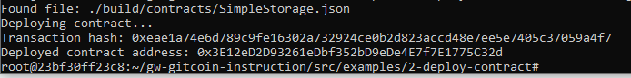

# Nervos Hackerthon - Gitcoin 2

1. A screenshot of the console output immediately after you have successfully deployed a smart contract.


2. The transaction hash from the contract deployment (in text format).
```
0xeae1a74e6d789c9fe16302a732924ce0b2d823accd48e7ee5e7405c37059a4f7
```

3. The deployed contract address from the contract deployment (in text format).
```
0x3E12eD2D93261eDbf352bD9eDe4E7f7E1775C32d
```