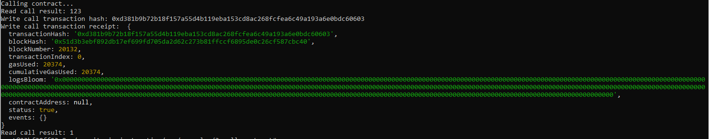

# Nervos Hackerthon - Gitcoin 3

1. A screenshot of the console output immediately after you have successfully issued a smart contract call.


2. The transaction hash from the console output (in text format).
```
0xd381b9b72b18f157a55d4b119eba153cd8ac268fcfea6c49a193a6e0bdc60603
```
3. The contract address that you called (in text format).
```
0x3E12eD2D93261eDbf352bD9eDe4E7f7E1775C32d
```
4. The ABI for contract you made a call on (in text format).
```
[
    {
      "inputs": [],
      "stateMutability": "payable",
      "type": "constructor"
    },
    {
      "inputs": [
        {
          "internalType": "uint256",
          "name": "x",
          "type": "uint256"
        }
      ],
      "name": "set",
      "outputs": [],
      "stateMutability": "payable",
      "type": "function"
    },
    {
      "inputs": [],
      "name": "get",
      "outputs": [
        {
          "internalType": "uint256",
          "name": "",
          "type": "uint256"
        }
      ],
      "stateMutability": "view",
      "type": "function"
    }
  ]
```