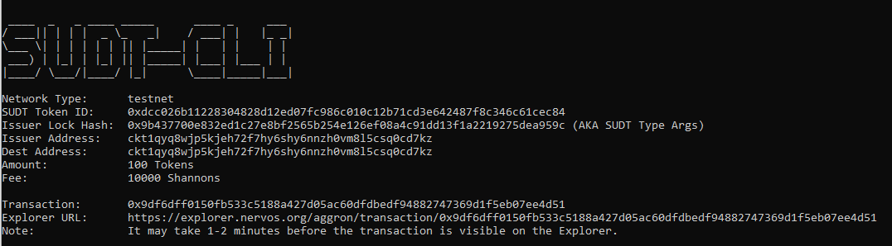
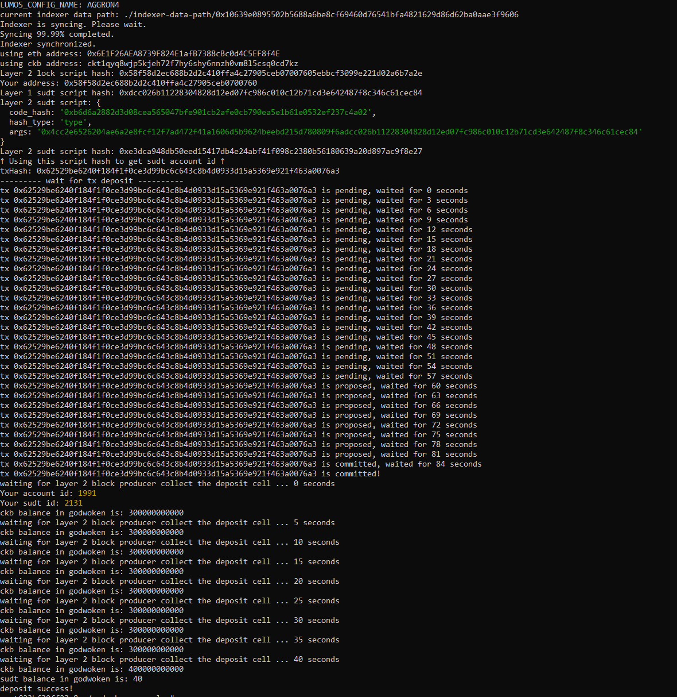

# Nervos Hackerthon - Gitcoin 4

1. A link to the Layer 1 address you funded on the Testnet Explorer.
```
https://explorer.nervos.org/aggron/address/ckt1qyq8wjp5kjeh72f7hy6shy6nnzh0vm8l5csq0cd7kz
```
2. A screenshot of the console output immediately after using sudt-cli to create your SUDT tokens on Layer 1.

3. A link to the transaction ID created by sudt-cli on the Testnet Explorer.
```
https://explorer.nervos.org/aggron/transaction/0x9df6dff0150fb533c5188a427d05ac60dfdbedf94882747369d1f5eb07ee4d51
```
4. A screenshot of the console output immediately after you have successfully submitted a deposit to Layer 2 using the account-cli tool.

5. The SUDT ID from the console output after executing the deposit script (in text format).
```
SUDT ID : 2131
```