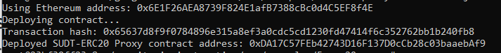
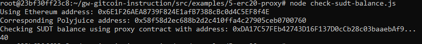

# Nervos Hackerthon - Gitcoin 5

1. A screenshot of the console output immediately after deploying smart contract.

2. The address of the ERC20 Proxy Contract you deployed (in text format).
```
0xDA17C57FEb42743D16F137D0cCb28c03baaebAf9
```
3. A screenshot of the console output immediately after checking your SUDT balance.

4. The Ethereum address that was checked (in text format).
```
0x6E1F26AEA8739F824E1afB7388cBc0d4C5EF8f4E
```
