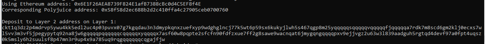

# Nervos Hackerthon - Gitcoin 6

1. A screenshot of the console output immediately after you have successfully generated your Deposit Receiver Address.

2. Your Deposit Receiver Address (in text format).
```
ckt1q3dz2p4mdrvp5ywu4kk5edl2uc4p03puvx07g7kgqdau3n3dmypkqnxzuefxyp9wdghglncj77k5wt6p59sx6kukyjlwh5s467qgp8m25yqqqqqsqqqqqvqqqqqfjqqqqqa7rdk7m8scd6gm2klj0ecxs7wl5vv3m3vf5jpegypytq92na8jw6gqqqqpqqqqqqcqqqqqxyqqqqx7asf60w8pqpte2sfcfn90fdfzxue7ff2g8sawe9wacnqat6jmygqngqqqqpxv9ejjvgz2u63w3l839aadguh5rgtqd4devf97a0fpt4uqsz0k5msly6h2suulsf8p47mn3r9up4x9a785uq9rqgqqqqqqcqgajfjw
```
3. The Ethereum address used to generate the Deposit Receiver Address (in text format).
```
0x6E1F26AEA8739F824E1afB7388cBc0d4C5EF8f4E
```
4. A link to the Etherscan explorer for the successful Force Bridge transaction. This can be found on Force Bridge under History→Succeed.
```
https://rinkeby.etherscan.io/tx/0xc5b15b0a9a3a75fcddc969c16bd985f8fc2d945934363c63b78f339b35302763
```
5. A link to the Nervos explorer for the successful Force bridge transaction. This can be found on Force Bridge under History→Succeed.
```
https://explorer.nervos.org/aggron/address/ckt1q3dz2p4mdrvp5ywu4kk5edl2uc4p03puvx07g7kgqdau3n3dmypkqnxzuefxyp9wdghglncj77k5wt6p59sx6kukyjlwh5s467qgp8m25yqqqqqsqqqqqvqqqqqfjqqqqqa7rdk7m8scd6gm2klj0ecxs7wl5vv3m3vf5jpegypytq92na8jw6gqqqqpqqqqqqcqqqqqxyqqqqx7asf60w8pqpte2sfcfn90fdfzxue7ff2g8sawe9wacnqat6jmygqngqqqqpxv9ejjvgz2u63w3l839aadguh5rgtqd4devf97a0fpt4uqsz0k5msly6h2suulsf8p47mn3r9up4x9a785uq9rqgqqqqqqcqgajfjw
```