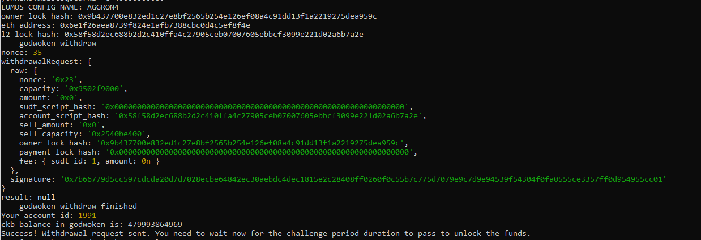

# Nervos Hackerthon - Gitcoin 9

1. A screenshot of the console output immediately after running the withdraw command.

2. The Ethereum address that you've used for your Layer 2 account (in text format).
```
0x6E1F26AEA8739F824E1afB7388cBc0d4C5EF8f4E
```
3. The Nervos Layer 1 address that you passed to withdraw command (in text format).
```
ckt1qyq8wjp5kjeh72f7hy6shy6nnzh0vm8l5csq0cd7kz
```